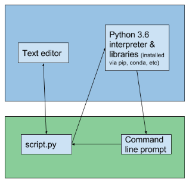
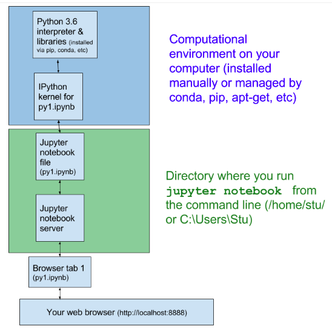

# 개발 환경


- Jupyter

- Colab


# Jupyter

일반적으로 python으로 프로그래밍을 한다고 하면 text editor로 python 파일 script.py를 수정하고

외부 실행파일 python을 구동해서 script.py를 실행하는 방식으로 진행한다.



jupyter의 경우 웹으로 보이는 ipynb(interactive python notebook)파일에 사용자가 수정한 사항이 Jupyter 서버에 전달되고 실행되어 그 결과가 다시 웹 화면에 보이게 된다.

이때 실제 코드를 실행시키는 것은 Jupyter 서버가 있는 곳의 python이다.





## 설치

python이 설치되면 같이 설치 된다.

## 구동과 중지

### 실행
```
$ jupyter-notebook --no-browser
```

### 중지

Ctrl+C

### 백그라운드에서 실행

```
$ nohup jupyter-notebook --no-browser &
```

중지
```
$ ps -ef | grep jupyter
  501 64406 520 0 2:53PM ttys001 0:01.43 /anaconda3/bin/python /anaconda3/bin/jupyter-notebook --no-browser
  501 64411 520 0 2:53PM ttys001 0:00.01 grep jupyter
$ kill -9 64406
  ```

# Colab

구글에서 운영하는 Jupyter 서비스.

이런 서비스가 없다면 사용자는 따로 Jupyter 서비스가 운영되는 서버를 구축하여야 한다.

단지 구글 계정만 있으면 무료로 Jupyter 서비스를 사용할 수 있다.

더욱이 하루에 12시간 이내로 GPU를 무료로 사용할 수 있다.

[https://colab.research.google.com/](https://colab.research.google.com/)


